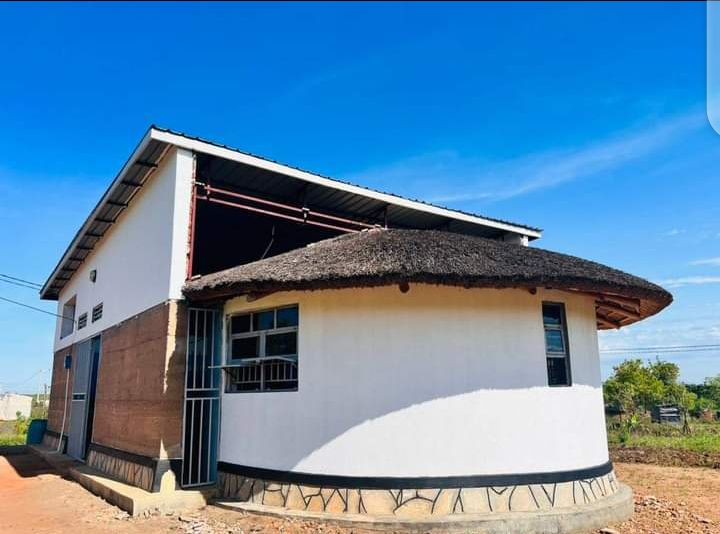

## ROSHOP-Responsive Open Source Modular Housing Prototype

### Pagirinya-Satellite-House

## Summery
This building, which aims to explore ways to create modular, easy to build, well lit and aerated community houses follows design elements adopted from many soruces including Ghanaian designs that use local materials to build eco-friendly houses made of cheap local material that include maram, stone dust, clay soil, sand soil and very little cement to give the structure strength and a water proof layer. No clay bricks, which use large amounts of wood for burning is used.

## Architectural elements:

### Technical Concept
The prototype relies on two key media and architectural elements: 
 - experimentation with local building innovation, improve and develop climate responsive construction methodologies, increasing air circulation and interior natural lighting, integrating the re-use of rain water and solar power. For example using ‘rammed earth’ technology for building walls as opposed to common but climate damaging burnt brick. 

 - documenting entire processes, methodologies and experiences using collaborative open source tools and platforms such as GitHub to share information, enabling communities in similar circumstances to reproduce, adapt and further develop the initial prototype. Teams building the prototypes learn valuable media and digital skills with which they can connect with peers and experts around the world to create new and efficient building typologies in extremely challenging environments.

### Visual Concept
The fusion of media and architecture relies on adapting known, traditional or context relevant visual and aesthetic components, with new forms or solutions for common building practice and functionality. Developing circular modules based on traditional tukul forms which can be combined with square shaped elements to accommodate various forms of activity. Roof constructions, using traditional and locally available materials are adapted such that fresh and ample lighting can enter the spaces, creating more conducive sheltered environments, improving the use of the structures to act as small schools or community gatherings. The media aspect lies in creating compelling digital documentation that moves beyond complex text and technical jargon, in order to better communicate the methodologies involved in the housing prototypes – creating this for any language and in low literacy environments.  

## Progressive processes of how the building is constructed.
- Bush Clearing. 
- Excavation
- Raising the wall of the Building
- Setting up the framework
- Filling and compressing the wall
- Roofing
- Continous documentation, knowledge exchange and building integration

## How the protoype house is being used in Pagirinya Satellite.
Pagirinya Satellite House is a sustainable ICT enhanced Social Network Space (SNS) aligned with YEF (Youth Empowerment Foundation, Adjumani) that targets bringing all the youth from different ethnic affiliation in Pagirinya and neighbouring South Sudan Refugees settlements and host communities in Uganda together for an engagement in;
- Open Tech innovation 
- Peacebuilding 
- MIL (media & information literacy)
- career inspiration and life skills. 

The aim of the satellite is to strengthen YEF’s activities in the region for a collective social mobilization as a strategy for empowering the youth to embrace active participation in; 
- peace 
- non-violence and reconciliation dialogues. 
In order to overcome the past ethnic prejudice or stereotypes, cultural rigidity/nostalgia, political differences, economic depressions and social losses. 
The Satellite will act as a workshop type entity making a new shifts with determined resolution to begin rebuilding better social cohesion in the settlement. A network of training via the SATELLITE is to be established and existing projects to connect the SATELLITE and youth, will be accelerated.

## Please Check this out;
<ul>
<li><a href="https://github.com/WeAreYEF/pagirinya-satelite-house">PAGarchLibrary</a></li>
<li><a href="https://wikifactory.com/+criticalmaking/roshop">Critical Making Repository</a></li>
<li><a href="https://demos.mediaarchitecture.org/mab/project/53)">Media Architechture</a></li>
</ul>

