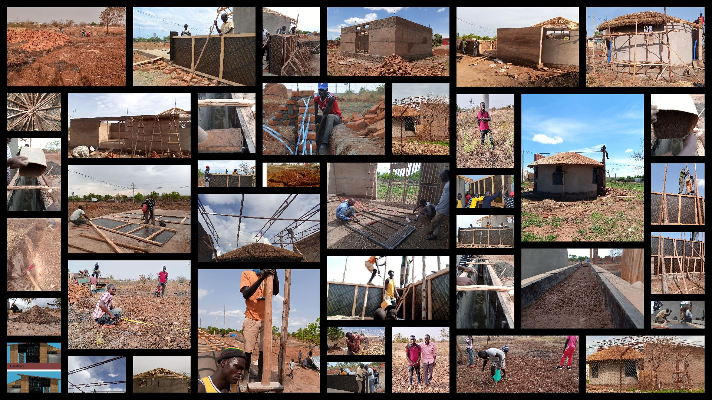

<b>#ROSHOP</b>

The Responsive Open Source Modular Housing Prototype `#ROSHOP` Modular House is a media and digital culture informed housing prototype for complex post-conflict and politically unstable environments, responsive to refugee, IDP and resource scarce needs.

Developed by use of open source tools and platforms, such as Git and GitHub that allowed local on-site builders and contributors to collaborate with global peers to develop more efficient and easy to build housing prototypes, especially for community use – embracing citizen’s participation, strengthening community well-being. Sharing the building methodologies, allows adaptation and further development of the prototypes to support both the rapid development of quality buildings as well as the critical learning of the requisite skills to do so.

### <u>**Descriptions**</u>

**Technical Concept** : The prototype relies on two key media and architectural elements: - experimentation with local building innovation, improve and develop climate responsive construction methodologies, increasing air circulation and interior natural lighting, integrating the re-use of rain water and solar power. For example using ‘rammed earth’ technology for building walls as opposed to common but climate damaging burnt brick. - documenting entire processes, methodologies and experiences using collaborative open source tools and platforms such as GitHub to share information, enabling communities in similar circumstances to reproduce, adapt and further develop the initial prototype. Teams building the prototypes learn valuable media and digital skills with which they can connect with peers and experts around the world to create new and efficient building typologies in extremely challenging environments.

**Visual Concept** : The fusion of media and architecture relies on adapting known, traditional or context relevant visual and aesthetic components, with new forms or solutions for common building practice and functionality. Developing circular modules based on traditional tukul forms which can be combined with square shaped elements to accommodate various forms of activity. Roof constructions, using traditional and locally available materials are adapted such that fresh and ample lighting can enter the spaces, creating more conducive sheltered environments, improving the use of the structures to act as small schools or community gatherings. The media aspect lies in creating compelling digital documentation that moves beyond complex text and technical jargon, in order to better communicate the methodologies involved in the housing prototypes – creating this for any language and in low literacy environments.

## other resources about the housing protype
- [#ROSHOP_Responsive Open Source Modular Housing Prototype by media architecture.org](https://demos.mediaarchitecture.org/mab/project/53)

- [ROSHOP by Critical Makers](https://wikifactory.com/+criticalmaking/roshop)

- [#ROSHOP by YEF ](https://yef-uganda.org/pagirinya-satellite-project/)
