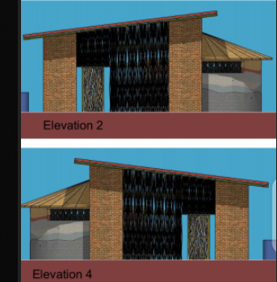
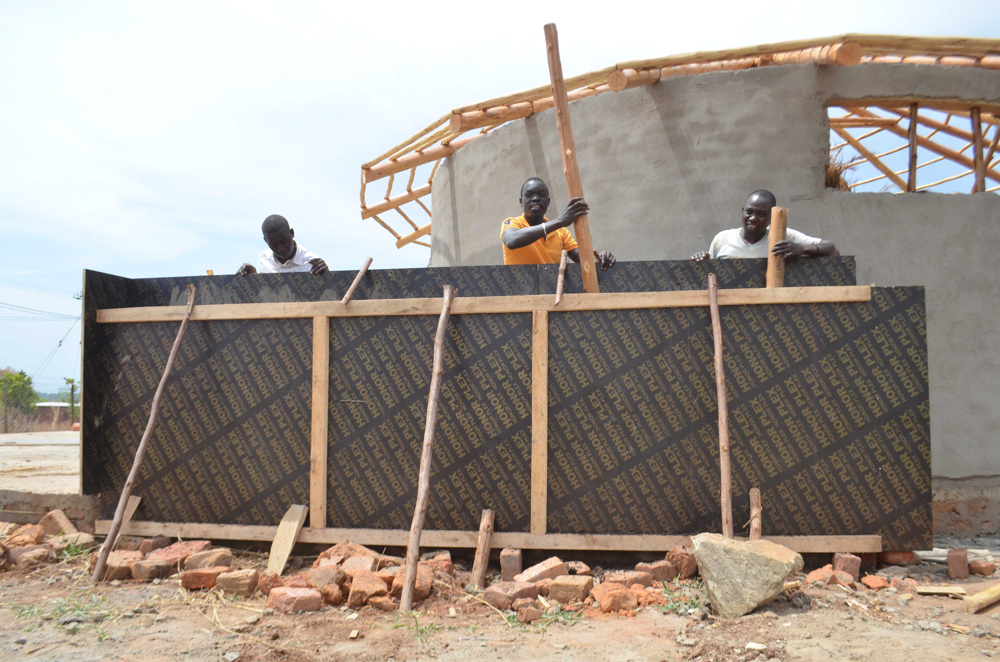
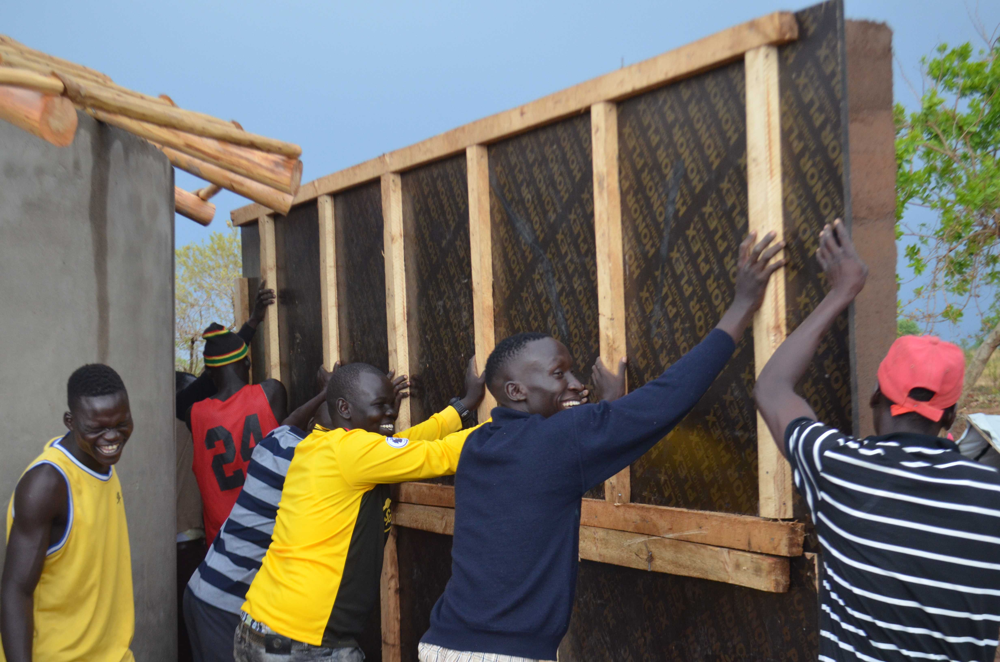
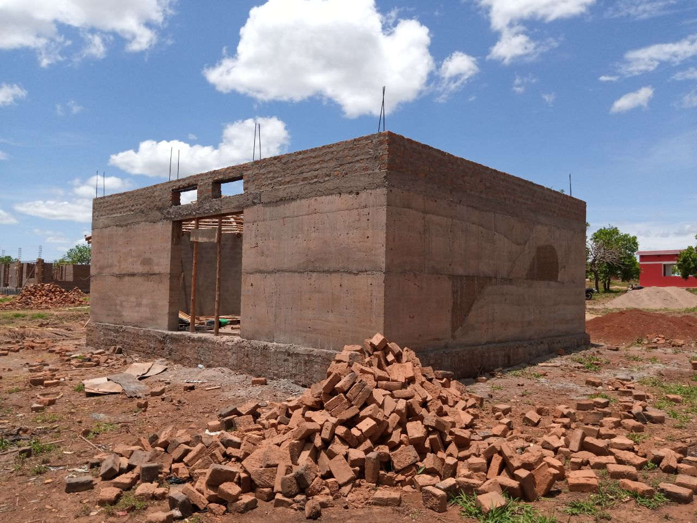

# THE CONSTRUCTION OF PROTOTYPE STEP BY STEP DESCRIPTION

The Pagirinya Satellite house to be prototype was designed under the mentorship of Canadian architect Peter Treuheit together with the YEF - Youth Empowerment Foundation community as part of the #ASKnet programme initiated by r0g_agency for open culture and critical transformation. 
This building, which aims to explore ways to create modular, easy to build, well lit and aerated community houses follows design elements adopted from many soruces including Ghanaian designs that use local materials to build eco-friendly houses made of cheap local material that include maram, stone dust, 
clay soil, sand soil and very little cement to give the structure strength and a water proof layer. No clay bricks, which use large amounts of wood for burning is used. 

*Below are images showing the full view of the Architectural drawing side.*
*NB All efforts are geared towards acheiving the design above*

## Below are the progressive processes of how the building was constructed.
-	Bush Clearing.
  The bush clearing commenced immediately after the land was commissioned to The Youth Empowerment Foundation by the Camp Commandant under the supervision of the Office of the 
  Prime Minister Adjumani.
- Gathering Of Materials 
  Materials for example pit sand, river sand, bricks and aggregates were gathered at the space by the help of Mr. Vuga William as the foundation. And few of the community members
  intervened in to help with lowering of the bricks.
- Foundation Setting 
  The foundation was set by Engineer (Mr. Idrifua Patrick), this was basically done to set the framework of dimension of floor the building will occupy.
  Tools Used: Rob, Square, Metallic Peak, Tape Measure
  
 

 
- Excavation
This is the process of digging the ground to remove the top layer of the soil, this was done to give a building a fixed attachment with the ground and also to prevent sinking 
of the house due to heavy rain. 
Tools Used: Pit Axe, Hoe, Metallic Sinking Rod, Panga and Spade.

- Raising the Foundation
  As in the picture below, the foundation raising is the process of building round the excavated framework to give the foundation a structure upon which the whole building rest. 
  This activity progressed with a number of subsequent sub task as illustrated in the pictures below
  Tools Used: Wooden rammer, Jump Compactor, wheel Barrow, Spade
  Material Used: Sand, Cement, Water, Maram, Brick 
  
- Raising the wall of the Building
  The wall of the satellite building was raised in two categories, namely the brick wall and the compressed mortar wall. The bricks were basically used to build the circular part
  of the house. This was because it was hard to find local material that could be curved into circular shape.
  The mortar component however is being achieved using a number of subsequent task as describe below. 
  1. Setting up the framework, the frame is the desired blue print that the mortared was is going to take, this was done using plain board of 200cmX100cm dimension. 
     This boards were hammered along a strong to prevent it from falling during the compression process. Below is the image of the framework setup
     
     
     
     
  2. Filling and compressing the wall, this was done after the framework layout was strengthen. The mortar was made of stone dust, clay soil, Maram, sand and cement, mixed in 
     the ratio of 2:2:2:2 wheelbarrow and bags respectively. The mixture was made with little water to just make it moist so that they can stick together unlike the watery one. 
     The moist or damp mortar is being poured in the framework and compressed firmly using locally made wooden hand compressor.
      
     
     
  3.	Uncovering the wall, after about four hours, the framework made of board is removed and the real wall structure left to stand as below.
      
      After series of repeating the processes, the whole structure obtained is as shown below.
      
  Material Used: Maram, Stone dust, clay soil, sand soil and cement
  Tools Used: Spade, Wheel Barrow, Hoe, Wooden compression tool, Wooden Pole, Plain Board (Honor Plex Brand) and watering can  

  
